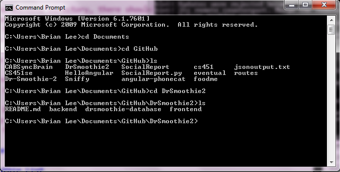
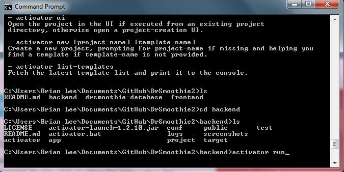
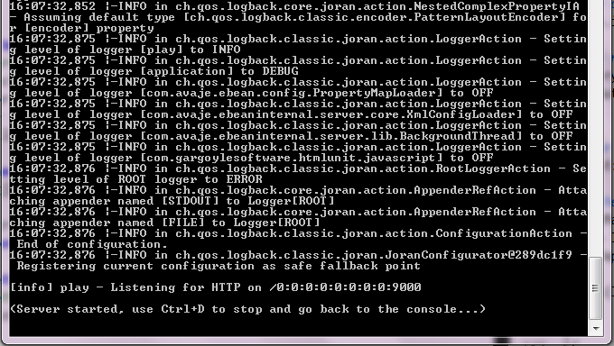

# Dr-Smoothie-2 

## Introduction
Dr-Smoothie is mobile web application that can be compiled into an iPhone or Android application. This application allows you to create a smoothie recipe and share it with Facebook friends or through the Dr-Smoothie application. It also allows you to find what smoothie recipe random people or your friends have made.

## Features
1. Create a Smoothie Recipe

2. Share Smoothie Recipes

3. Find other's Smoothie Recipes

4. See what nutrients are in a smoothie recipe

## Need Components:
### PlayFramework & MongoDB was used for the Backend
### Ionic/AngularJs/Bootstrap was used for the Frontend 

1. Play Framework 2.1.5

2. MongoDB 2.4.8

3. AngularJS 1.1.5

4. Bootstrap 3.0.2

5. jQuery 1.10.2 (used by 4)

6. Ionic

## How to do Deployment
Follow these steps in order to deploy the seed on your machine:

1. Download and extract Play Framework/activator(This may not be necessary)
1a. Scala/sbt is needed to run play apps

2. Download and extract latest MongoDB

3. Clone the project: <code>git clone https://github.com/brianlee389/Dr-Smoothie-2.git</code>.

4. Start <code>mongod</code> (the daemon process for the MongoDB system).

5. Create and populate the databases using the mongo commands
There is a list of json files given in the directory: DrSmoothie2/drsmoothie-database/exportdata

6. How to export data to mongo:
Run the mongo command after running mongod.exe (use dr-smoothie-2) 
mongoimport.exe --db dbname --collection collectionname(nutrients) --file jsonfilename
ex)
mongoimport.exe -
-db dbname --collection nutrients --file nutrients.json

7. Do the export for each of the json files given. The files are named collections.json ex) nutrients.json, ingredients.json 

8. In the backend directory, there should be a program called activator.
8a. Run the activator command line program
8b. This will lead to program being compiled and jumped into activator mode
8c. type in run and the server will run

9. Alternatively you can run the command: activator run, which will run the server with localhost:9000 

10. The backend only serves JSON
ex) http://localhost:9000/api/(collectionsname)
look in the routes file located in the directory: backend/conf/routes

## Screenshots

### Navigating the DrSmoothie2 repo

After cloning the github repo, go into the DrSmoothie2 directory.
And the directories will be seen.
The directory, frontend, contains all the mobile web application components

### Running the backend

Navigate to directory called backend. Then run the command line program activator run
After the server should be running and the mobile web application can now make calls to the server.

### What Cmd line looks like when server is running

You can press Ctrl+D to stop the server.
### Adding a Smoothie

##MUST READ
Please ignore the public folder, it is generated template html files from making a Play Application!
